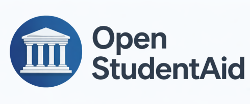

# Open StudentAid

Open StudentAid is a local, headless Playwright login + API wrapper that pulls your Nelnet loan data and stores tokens on your machine.

## What it does
- Logs in to Nelnet with the real browser flow and MFA
- Remembers the device using a persistent Playwright profile in `.osa/`
- Fetches borrower loan details and totals from the servicer API

## Quick start

Install dependencies:

    python -m venv .venv
    .\.venv\Scripts\activate
    pip install -U pip
    pip install -e .

Create `.env` in the project root:

    STUDENT_AID_PROVIDER=nelnet
    STUDENT_AID_USERNAME=your_username
    STUDENT_AID_PASSWORD=your_password
    STUDENT_AID_MFA_METHOD=sms

Run the test script:

    python test.py

## Usage

```python
from open_studentaid import login, loan_summary, loan_details

# First-time login (MFA required)
login(
    provider="nelnet",
    username="your_username",
    password="your_password",
    mfa_method="sms",  # or "email"
    remember_device=True,
)

# Fetch totals
total, count, raw = loan_summary(provider="nelnet")
print(total, count)

# List per-loan balances
for loan in loan_details(provider="nelnet"):
    print(loan["loanId"], loan["totalBalance"])
```

## Notes
- The first login requires an MFA code. After that, Nelnet should remember the device for 90 days.
- Tokens are saved under `~/.studentaid/`. The Playwright browser profile is saved under `.osa/`.
- The only API endpoint used today is borrower details, which includes all your loans and balances.

## License
MIT (see `LICENSE`).
