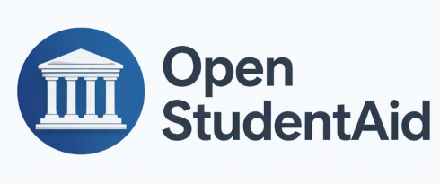

# Open StudentAid

View your preferred student loan provider's loan summary through an easy-to-use API wrapper.

> [!WARNING]
> Only available with a headed session via Chromium due to restrictions by studentaid.gov.

## Setup

### macOS

```bash
python3 -m venv .venv
source .venv/bin/activate
python -m pip install -r requirements.txt -e .
python -m playwright install chromium
```

### Linux desktop session

```bash
python3 -m venv .venv
source .venv/bin/activate
python -m pip install -r requirements.txt -e .
python -m playwright install chromium
```

### Ubuntu terminal server

```bash
sudo apt update
sudo apt install -y xvfb
python3 -m venv .venv
source .venv/bin/activate
python -m pip install -r requirements.txt -e .
python -m playwright install chromium
```

### Windows PowerShell

```powershell
py -m venv .venv
.venv\Scripts\Activate.ps1
python -m pip install -r requirements.txt -e .
python -m playwright install chromium
```

## Methods

### Login

| Method | Description |
|---|---|
| `login()` | Log in with Nelnet credentials and SMS, email, or authenticator MFA. |
| `ensure_login()` | Reuse or refresh the saved login. |
| `save_session()` | Save the current browser session under `.osa/`. |

### Non-mutating methods

| Method | Description |
|---|---|
| `loan_snapshot()` | Return total balance, loan count, and each account summary. |
| `loan_summary()` | Return the total balance, loan count, and raw response. |
| `loan_details()` | Return normalized details for each loan. |
| `get_amount()` | Return the total amount owed. |
| `get_data()` | Return the raw borrower data. |

Methods are available as top-level functions or on `StudentAid`.

The methods are designed for providers using a `.studentaid.gov` domain, including Nelnet, Aidvantage, and others.

## Tests

```bash
python -m unittest discover -s tests -v
```

Interactive smoke test:

```bash
python tests/smoke_test.py
```

## License

MIT (see `LICENSE`).

## Notice

Open StudentAid is not affiliated with, endorsed by, or sponsored by StudentAid.gov, Nelnet, Aidvantage, or any other loan provider. Use it at your own risk and only to view your own data.
